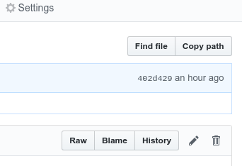

# Employee information

If you are a new employee at FabLab Barcelona, please do the following:

1. Get a free [Github account](https://github.com/join). It only takes a minute! :watch:
   * Please **add your profile picture** https://github.com/settings/profile
1. Ask someone who has admin access to add your **username** to the fablabbcn organization *team* called **Employees** at https://github.com/orgs/fablabbcn/teams/employees 
   * This will give you write access to some repositories, like this one and our main website.
1. Add your details in the **fablabbcn-web** repo, this file: https://github.com/fablabbcn/fablabbcn-web/blob/master/_data/employees.yml 
   * [How to edit files on Github](#how-to-edit-a-file-on-github)
   * Now your information should be available on our About page: https://fablabbcn.org/about_us 
1. Also join our [Slack](https://fablabbcn.slack.com/) channel, and again, **please add your profile picture** :cop: 
   * In Slack, click your **username** (top left), and **Profile & Account**
   * This will help people connect your name to your face :alien:

### Bonus :octocat:
* If you like emojis, here is all the emojis that Github supports: https://gist.github.com/rxaviers/7360908 :horse: :trollface:
* [Learn Markdown](https://www.markdowntutorial.com/lesson/1/) - We are increasingly using markdown in our projects!

### How to edit a file on Github

1. Make sure you have selected the correct file by clicking it in the repository
2. Click the **pencil** (edit) button on the right :pencil:

   
3. Make your changes 
4. Click the green **Commit Changes** button :heavy_check_mark:

### Working with our main website fablabbcn.org
* Our [main website][https://fablabbcn.org] is 100% open with all it's content on [Github](https://github.com/fablabbcn/fablabbcn-web)
* We host our page on Github Pages 
   * Every git commit to the repository will automatically go to the live page (within a minute)
* Github Pages uses Jekyll
   * Jekyll has [Video Walkthroughs](https://jekyllrb.com/tutorials/video-walkthroughs/) - Watch them to learn the basics!
* We are also trying out Forestry.io and CloudCannon to handle (abstract) adding content to the website

### Other links
https://github.com/fablabbcn  
https://fablabbcn.org/about_us  
http://rules.fablabbcn.org  
